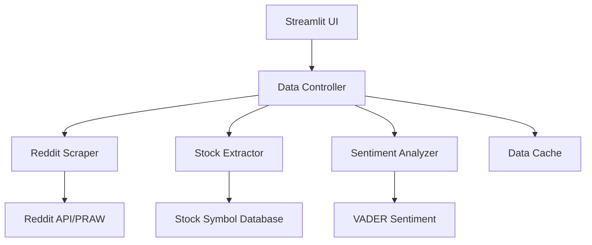

# Design Document

## Overview

The Reddit Stock Sentiment Tracker is a Streamlit web application that scrapes r/wallstreetbets, identifies the most mentioned stocks, performs sentiment analysis, and displays results in an interactive dashboard. The application uses PRAW (Python Reddit API Wrapper) for Reddit data collection, VADER sentiment analysis for text processing, and Streamlit for the web interface.

## Architecture

The application follows a simple three-layer architecture:

1. **Data Collection Layer**: Handles Reddit API interactions and data scraping
2. **Processing Layer**: Performs stock mention extraction and sentiment analysis
3. **Presentation Layer**: Streamlit web interface for displaying results



## Components and Interfaces

### RedditScraper
- **Purpose**: Fetch posts and comments from r/wallstreetbets
- **Key Methods**:
  - `get_hot_posts(limit=100)`: Fetch hot posts from the subreddit
  - `get_post_comments(post_id)`: Retrieve comments for a specific post
- **Dependencies**: PRAW library, Reddit API credentials
- **Output**: List of post and comment text data

### StockExtractor
- **Purpose**: Identify stock ticker mentions in text
- **Key Methods**:
  - `extract_tickers(text)`: Find stock symbols in text using regex
  - `get_top_mentioned(posts, limit=10)`: Count and rank stock mentions
- **Dependencies**: Pre-defined list of valid stock tickers
- **Output**: Dictionary of stock symbols and mention counts

### SentimentAnalyzer
- **Purpose**: Analyze sentiment of text mentioning specific stocks
- **Key Methods**:
  - `analyze_stock_sentiment(stock_symbol, texts)`: Calculate sentiment for a stock
  - `get_sentiment_score(text)`: Get VADER sentiment score for text
- **Dependencies**: VADER sentiment analyzer
- **Output**: Sentiment scores (-1 to 1) and categories (Positive/Negative/Neutral)

### StreamlitUI
- **Purpose**: Web interface for displaying results
- **Key Components**:
  - Main dashboard with data table
  - Refresh button for updating data
  - Loading indicators and error messages
  - Color-coded sentiment display
- **Dependencies**: Streamlit, Pandas for data display
- **Output**: Interactive web application

## Data Models

### StockMention
```python
@dataclass
class StockMention:
    ticker: str
    mention_count: int
    sentiment_score: float
    sentiment_category: str  # "Positive", "Negative", "Neutral"
    last_updated: datetime
```

### RedditPost
```python
@dataclass
class RedditPost:
    id: str
    title: str
    content: str
    comments: List[str]
    created_utc: datetime
    score: int
```

### SentimentResult
```python
@dataclass
class SentimentResult:
    compound_score: float  # -1 to 1
    positive: float
    negative: float
    neutral: float
    category: str
```

## Error Handling

### Reddit API Errors
- **Rate Limiting**: Implement exponential backoff and retry logic
- **Authentication Failures**: Display clear error messages about API credentials
- **Subreddit Access**: Handle private/banned subreddit scenarios
- **Network Issues**: Graceful degradation with cached data when possible

### Data Processing Errors
- **Invalid Stock Symbols**: Filter out non-existent tickers
- **Empty Data Sets**: Handle cases where no stocks are mentioned
- **Sentiment Analysis Failures**: Continue processing with mention counts only

### UI Error States
- **Loading States**: Show spinners during data fetching
- **Error Messages**: User-friendly error descriptions
- **Fallback Data**: Display cached results when live data unavailable
- **Retry Mechanisms**: Allow users to manually retry failed operations

## Testing Strategy

### Unit Tests
- **RedditScraper**: Mock Reddit API responses, test data parsing
- **StockExtractor**: Test ticker extraction with various text formats
- **SentimentAnalyzer**: Verify sentiment scoring with known positive/negative text
- **Data Models**: Validate data structure integrity

### Integration Tests
- **End-to-End Flow**: Test complete pipeline from Reddit scraping to UI display
- **API Integration**: Test actual Reddit API calls with test credentials
- **Error Scenarios**: Simulate API failures and verify error handling

### Manual Testing
- **UI Functionality**: Verify Streamlit interface works correctly
- **Data Accuracy**: Manually verify sentiment scores make sense
- **Performance**: Test with various data loads
- **Deployment**: Verify application works on Streamlit Cloud

## Configuration and Deployment

### Environment Variables
- `REDDIT_CLIENT_ID`: Reddit API client ID
- `REDDIT_CLIENT_SECRET`: Reddit API client secret
- `REDDIT_USER_AGENT`: User agent string for API requests

### Dependencies
- `streamlit`: Web framework
- `praw`: Reddit API wrapper
- `vaderSentiment`: Sentiment analysis
- `pandas`: Data manipulation
- `requests`: HTTP requests
- `python-dotenv`: Environment variable management

### Deployment Configuration
- **Streamlit Cloud**: Use `requirements.txt` and `secrets.toml` for configuration
- **Environment Setup**: Configure Reddit API credentials in Streamlit secrets
- **Resource Limits**: Design for Streamlit Cloud's memory and processing constraints

## Performance Considerations

### Data Caching
- Cache Reddit data for 15-30 minutes to reduce API calls
- Store processed sentiment results to avoid recomputation
- Use Streamlit's built-in caching mechanisms

### API Rate Limiting
- Respect Reddit API rate limits (60 requests per minute)
- Implement request queuing for large data sets
- Use batch processing where possible

### UI Responsiveness
- Show loading indicators for long-running operations
- Process data in background while displaying cached results
- Limit initial data load to ensure fast page loads